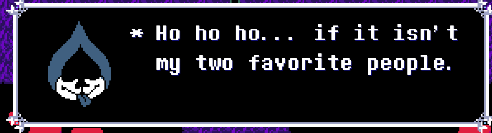
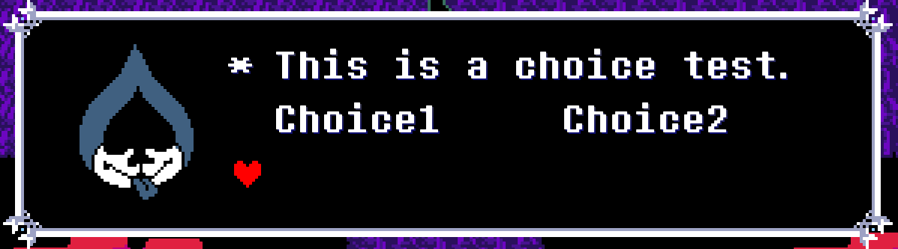

## 语言文件的对话文本格式（lang_en.json）

遇到以下字符时不播放音效(人物说话的音效，下同)：  
` `(空格), `^`, `!`, `.`, `?`, `,`, `:`, `/`, `\`, `|`, `*`

### 特殊字符

**`\`**：在对话文本的最后，表示这一次的文本显示完了，将会清空当前对话框里的所有文本

---
**`%`**：在对话文本的最后，表示这整个对话都显示完了，将会关闭对话框，必须接在`\`的后面，不能单独使用

---
**`&`**：换行  
例：`\\E1* Yeah I&guess that&makes&sense./`

---
**`|`**：相当于空格  
例：`\\E1* A test te|xt./`

---
**`^x`**：x为数字，停顿指定的时间  
例：`\\E1* A test t^2e^2x^2t./`

---
**`\Ex`**：x为0-9或A-E的数字/字母，放在对话文本的开头，选择当前人物指定表情的编号

---
**`\Fx`**：未知

---
**`\Tx`**：当前对话文本的效果和人物音效，有下列音效可用：  
`0` - 暗世界字体大小(可能为自动调整) + 默认音效（旁白） typer 亮世界为5，暗世界为6，战斗时为4  
`1` - 亮世界字体大小 + 无音效 typer=2  
`A` - 亮世界字体大小 + Asgore 音效 typer=18  
`a` - 亮世界字体大小 + Alphys 音效 typer=20  
`N` - 亮世界字体大小 + Noelle 音效 typer=12  
`n` - 亮世界字体大小 + Noelle(?) 音效 typer=23  
`B` - 亮世界字体大小 + Alphys 音效 typer=13  
`S` - 暗/亮世界字体大小 + Susie 音效 typer=10(亮世界)或30(暗世界)或47(战斗时)  
`R` - 暗世界字体大小 + Ralsei 音效 type=31(暗世界)或45(战斗时)或6(flag[30]==6时)  
`L` - 暗世界字体大小 + Lancer 音效 typer=32(暗世界)或46(战斗时)  
`X` - 亮世界字体大小 + 无音效 typer=40  
`r` - 亮世界字体大小 + Rudolph "Rudy" Holiday (Noelle父亲)音效 typer=55  
`T` - 亮世界字体大小 + Toriel 音效 typer=7  
`J` - 暗世界字体大小 + Jevil 音效 typer=35  
`K` - 暗世界字体大小 + 无音效 typer=33(暗世界)或36(global.plot < 235)或48(战斗时)  

---
**`\sx`**：x为0或1，表示是否可以跳过对话，0=不可跳过，1=可跳过

---
**`\cx`**：文字颜色，x可以为一下几种：  
`R` - 红色  
`B` - 蓝色  
`Y` - 黄色  
`G` - 绿色  
`W` - 黑色  
`X` - 白色  
`0` - 自定义(self.mycolor)  

---
**`\Cx`**：可以选择的文本，x可以为一下几种  
`1` - obj_choier_old  
`2` 或 `3` 或 `4` - obj_choier_neo  
例：`* This is a choice test.&Choice1     Choice2\\C1 /`  

