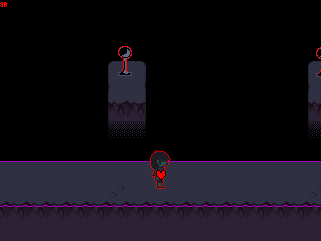

| 房间ID |  房间名称(游戏内)  |    房间名称(代码内)    |                             说明                             |
| :----: | :----------------: | :--------------------: | :----------------------------------------------------------: |
|   1    |         -          |     PLACE_CONTACT      |                     开始游戏时的命名界面                     |
|   2    |    Kris's Room     |     room_krisroom      |                          Kris的房间                          |
|   3    |         -          |    room_krishallway    |                        Kris家2楼走廊                         |
|   4    |         -          |      room_torroom      |                     Toriel的房间(未使用)                     |
|   5    |         -          |     room_torhouse      |                          Kris家1楼                           |
|   6    |         -          |    room_torbathroom    |                          Kris家厕所                          |
|   7    |         -          |   room_town_krisyard   |                         Kris家房子前                         |
|   8    |         -          |  room_town_northwest   |                     小镇西南部分(未使用)                     |
|   9    |         -          |    room_town_north     |                         小镇正南部分                         |
|   10   |         -          |       room_beach       |                  沙滩、水池(有洋葱桑的地方)                  |
|   11   |         -          |     room_town_mid      |            小镇十字路口处(QC's Diner、Sans、公寓)            |
|   12   |         -          |  room_town_apartment   |                            未使用                            |
|   13   |         -          |    room_town_south     |                小镇十字路口处(图书馆、Undyne)                |
|   14   |         -          |    room_town_school    |                            学校前                            |
|   15   |         -          |    room_town_church    |                        教堂、市镇大厅                        |
|   16   |         -          |     room_graveyard     |                          教堂旁墓地                          |
|   17   |         -          |   room_town_shelter    |                  教堂下会发出噪音的奇怪的门                  |
|   18   |         -          |  room_hospital_lobby   |                      进入医院第一个房间                      |
|   19   |         -          | room_hospital_hallway  |                     医院-有两个门的走廊                      |
|   20   |         -          |   room_hospital_rudy   | 医院-有Noelle的房间 |
|   21   |         -          |  room_hospital_room2   |        |
|   22   |         -          |       room_diner       |                        QC's Diner里面                        |
|   23   |         -          |     room_townhall      |                         市镇大厅里面                         |
|   24   |         -          |   room_flowershop_1f   |                       Asgore的花店1楼                        |
|   25   |         -          |   room_flowershop_2f   |              Asgore的花店2楼(改存档会游戏崩溃)               |
|   26   |         -          |      room_library      |                          图书馆里面                          |
|   27   |         -          |    room_alphysalley    |                      Alphy所在的小巷子                       |
|   28   |         -          |    room_torielclass    |                         Toriel的教室                         |
|   29   |         -          |    room_schoollobby    |                     进入学校的第一个房间                     |
|   30   |         -          |    room_alphyclass     |                         Alphy的教室                          |
|   31   |         -          |    room_schooldoor     |                           储物室前                           |
|   32   |         -          |   room_insiedcloset    |                          储物室里面                          |
|   33   |         -          | room_school_unusedroom |                           废弃教室                           |
|   34   |         -          |       room_dark1       |    暗世界的第一个房间    |
|   35   |       ??????       |      room_dark1a       |                        34号房间的左边                        |
|   36   |         -          |       room_dark2       |                       ??????房间的左边                       |
|   37   |         -          |       room_dark3       |                          |
|   38   |         -          |      room_dark3a       |                        |
|   39   |         -          |   room_dark_wobbles    |                  |
|   40   |     Eye Puzzle     |  room_dark_eyepuzzle   |                |
|   41   |         -          |      room_dark_7       |                          遇见Susie                           |
|   42   |         -          |    room_dark_chase1    |                 遭受(Lancer)攻击的第一个房间                 |
|   43   |         -          |    room_dark_chase2    |                 遭受(Lancer)攻击的第二个房间                 |
|   44   |         -          | room_castle_outskirts  |                           瀑布下面                           |
|   45   |    Castle Town     |    room_castle_town    |                          城堡小镇前                          |
|   46   |         -          |   room_castle_front    |                          城堡小镇里                          |
|   47   |         -          |  room_castle_tutorial  |                       Ralsei的战斗教程                       |
|   48   |         -          |  room_castle_darkdoor  |                        城堡小镇的大门                        |
|   49   | Field - Great Door |    room_field_start    |                         平原 - 大门                          |
|   50   |         -          |         room_          |                                                              |
|   51   |         -          |         room_          |                                                              |

